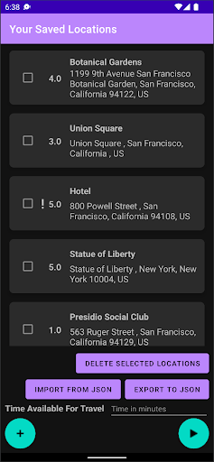
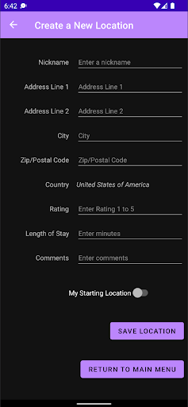
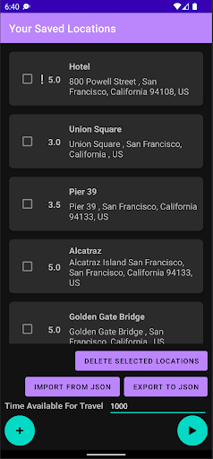
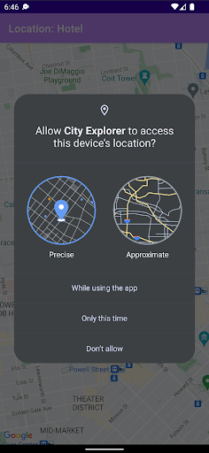
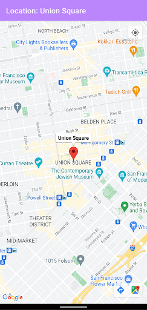
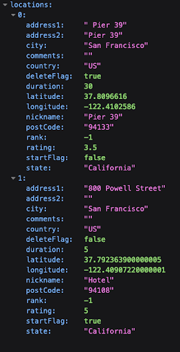
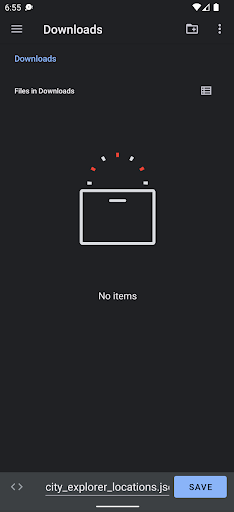
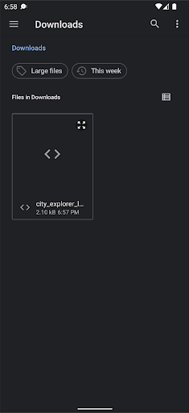

# City Explorer Android App

The City Explorer Android application is a planning system for travelers.
At its core, the application enables users to optimize their planned
travel destinations to get the most out of the time available to them.
The user manages a list of saved travel locations that are displayed
in a list on the home fragment. A floating action play button is on
screen, which optimizes the travel route based on the user’s inputs
for each location and their total available time for travel,
(Figure 1, Figure 3).

## Demo

Demo Video: [https://youtu.be/Nrf5-DkQiTc](https://youtu.be/Nrf5-DkQiTc "Demo Video")

## Project Setup

The project build files, such as the project and application gradle files and the manifest file manage the project in
Android Studio. We followed the “Set up an Android Studio project” for the standard project setup, [10]. We also
utilized the “Maps SDK for Android Quickstart” for configuring the project to work with the Maps SDK, [11].

The main unique requirement for developing the City Explorer application, beyond typical Android Studio installation
steps, is the configuration of the Google services API key and SHA1 certificate pair whenever a new developer is added
to the project. This is required for security purposes, and should not affect users if the build machine has been added.
Please follow the detailed instructions on restricting API keys using the developer admin/billing account, [9]. If the
SHA1 is not added in the Google Cloud console for a new developer machine, then the Maps activity will display a blank
area in the layout rather than loading data and displaying the map.

## Services and Libraries

City explorer uses several external services to retrieve data for the optimization and for user features.
Services:

- Maps SDK for Android, [1]
    - Geocoding API, [2]
- Third party libraries:
    - Gson Library, [3]
    - Retrofit2 Library, [4]
- Android features highlighted:
    - Navigation UI, [12]
    - ViewModel, [13]

The most important external services for City Explorer are the Google Maps SDK for Android and the Geocoding API. Both
of these services are freely available for our application due to the lower user count for a student project. These
services are configured and managed within the Google Cloud console, where we administer security and limit how the
service APIs can be used to prevent unwanted access or usage using an API Key with developer machine SHA1 stored in the
console.

We used two third party libraries within the application to develop some features. The Retrofit2 library was used
because this library’s Retrofit.Builder enables creation of our LocationJsonApi for interacting with a public Geocoding
API, [14] Ultimately we decided to utilize the Maps SDK Geocoder, however we retained the Retrofit.Builder as a
secondary backup in case we needed to migrate to another service while developing the applications. The Gson library is
used extensively to persist user saved location data to the application storage. This library has convenience functions
like toJson, which is able to convert Java classes, in our case List<Location>, to a JSON formatted string;
serialization. Most of the heavy lifting happens with the Gson JsonDeserializer to convert JSON to a String for our
application (serialization with Gson.toJson) and to convert a JSON String to a Location class instance (deserialization
with Gson.fromJson).

The Android operating system has many features that developers can use when building their application features. A few
we wanted to highlight include Navigation UI and ViewModel. We utilized Navigation UI, which reduces the code complexity
in our application when navigating between fragments. This built-in Android feature utilizes a navigation graph, which
is constructed by the developer using a simple XML file. Actions define the routes a user can take between fragments,
and the developer simply calls a navigation graph action whenever a fragment change is needed. This led to our
architecture focusing on a single MainActivity with fragments serving our UI needs. We paired the Navigation UI with the
Android ViewModel as MVVM architecture. The ViewModel gives huge advantages by standardizing the UI updates using a
single source of truth. In our case, we discuss some added complexities given we decided to persist saved locations in a
JSON file to support an import and export from and to JSON in the Project Development section of our writeup. We
extended additional functionality to synchronize data in the JSON file with the ViewModel using functions written in our
application-level ViewModel class. As we discuss further in Project Development, we ran into a learning curve regarding
how to launch various activities related to the Storage Access Framework given our MVVM architecture. Our solutions
involved launching activities within our fragments and passing URIs to the ViewModel for reading and writing from and to
files.

Ultimately we had a positive experience using several services, third party libraries, and Android features to develop
features for the City Explorer travelers. We were aided greatly by the well maintained and detailed documentation
provided by the library and Android authors. Also our experiences developing various features and applications during
our coursework prepared us to define architecture and select various elements to develop our features. We could not have
been successful without these extensive resources.

## UI and UX

When the user clicks the + floating action button on the home fragment, they are taken to the new location fragment,
where they enter data for new locations. If the location is marked as the starting location for the travel, this will
always be optimized as the first travel destination, (Figure 2).

When the user clicks the play floating action button on the home fragment, this calculates the optimized route given the
user’s saved locations. The list of saved locations is resorted based on the optimization. The first location on the
list is the user’s starting location after optimization. The user is required to have entered the “Time Available For
Travel” value, which is required to optimize the travel route; otherwise a Toast message will be displayed, (Figure 3).

**Figure 1**, The home fragment is visible when the app starts.
The saved locations are available along with several
controls.

**Figure 2**, The user has clicked the plus button and is able to create new locations.

**Figure 3**, The user has 1,000 minutes available for their San Francisco travel.
After clicking the play button, the travel is optimized.

When the user clicks on a saved location, the Maps activity will start with the zoom centered on the address and a
marker displayed on the map. If this is the first usage of the map after the City Explorer app is installed, the user is
prompted for device location permissions, (Figure 4). The location nickname is displayed in the action bar and as a
marker tag at the position of the saved location, (Figure 5). Additionally, the map navigation buttons and the “my
location” buttons are available when using the map to aid in map usage, (Figure 5).

In addition, the user’s data is persisted in a JSON file in the app storage. When the “Import From JSON” button is
clicked, the Storage Access Framework is used to allow the user to select the file. Similarly, when the “Export To JSON”
button is clicked, the same framework enables the user to save a new JSON file wherever they decide, (Figure 6).

**Figure 4**, The user is prompted for device location permissions.

**Figure 5**, The “Hotel” saved location is displayed centered on the map with a marker.

**Figure 6**, The data is persisted in a JSON file which the user can export or import.

**Figure 7**, The user has clicked the “Export To JSON” button in the home fragment.
The Storage Access Framework defaults to saving to their device Downloads folder
with the filename pre-populated as “city_explorer_locations.json”

**Figure 8**, The user has clicked the “Save to JSON” button in the home fragment.
The Storage Access Framework remembers recent locations and the user can select
JSON files from device user or cloud storage locations.

## Architecture

The application consists of three fragments (main fragment, locations fragment and maps fragment), which navigate
between each other. The functionality is described below.

The MainFragment.kt, which consists of these elements, (Figure 1).

1. A list of locations where the name, full address (address, city, state, zip code, etc) and user-assigned rating is
   displayed.
2. Import locations from a JSON file. This will take the user to the phone system to select a directory and find the
   JSON file to import it.
3. Export locations to a JSON file. This will take the user to the phone system to select a name for the JSON file and a
   directory to export and save it.
4. Delete one or multiple locations. However, a location which has been added as “starting location” cannot be deleted.
5. Click on a location to view it on the map. This will take the user to the map fragment.
6. Add new locations. This will take the user to the location fragment.
7. Create an optimized route, after adding the total available time, which will create a ranked list of locations for
   the user to visit, starting from the starting location.

The LocationFragment.kt, which consists of these elements, (Figure 2).

1. Various fields (nickname, address, city, zip code, country, state, length of stay, comments) related to the location.
2. A starting location checkbox which indicates if this is a starting location (checked) or a location to visit (
   unchecked).
3. A save location button, which saves the location based on the information the user has inserted, as well as the
   checkbox option.
4. A return to main menu button which returns to the main fragment and the main menu.

The MapsActivity.kt, which consists of these elements, (Figure 5).

1. The map, which includes a pin to the selected location.
2. The system back button, which takes the user back to the main fragment and the main menu.

Apart from the aforementioned fragments, the functionality of their elements and the navigation between them as it was
described above, the application’s architecture also incorporates data persistence through saving and retrieving the
data from a JSON file. During each action of adding or deleting locations from the list, the recycler view list is
updated in a real-time manner, along with the viewmodel, and the JSON is synced as well.

It is worth noting that we restrict the list to having one starting location. The user may add zero, one or many
starting locations though. In case of zero starting locations, then the route optimization algorithm naturally considers
the first added location to be the starting locations. In case of many starting locations, then the last starting
location added by the user is considered to be the starting location and the rest of locations are considered points of
interest for the user to visit.

Then, for the deletion functionality specifically, we allow for deleting one or multiple locations at once. However, we
prevent the starting location from being deleted. If multiple locations are selected for deletion and the starting
location is included in them, then all of these locations are deleted but the starting location remains in the list.

Furthermore, special consideration was added to turning user input into a nicely displayed valid address by making use
of geocoding and string manipulation on the backend as well as various visual enhancements such as dark themed screen
and carefully designed xml row boxes for the front end.

Finally, the route optimization algorithm utilizes a weighted greedy algorithm and uses a good approximation method for
distance through the use of the WGS84 ellipsoid metric in order to avoid the billing of the Google Maps Directions API.
The metric used to rank the locations combines both distance and user ranking which adds to the complexity of the
algorithm, but also to its usefulness, as we want to recommend places that combine a good rating with a reasonable
travel distance.

## Project Development

An interesting aspect of development was the navigation between different fragments (main fragment, location fragment,
maps fragment) where the user could perform various actions. These actions had to be registered to both the viewmodel
and the recyclerview, as they both had to be updated in real-time, and to the JSON file as well! Synchronizing all of
the above in a well-defined pipeline and in a real-time manner was certainly a challenge but also a very rewarding
learning experience.

Another hurdle was managing and validating edge cases of user input when it came to adding locations. We took into
account blank fields, invalid input and many more factors in order to ensure a proper transition from user input to
geocoding and proper display in the list. Furthermore, the user could add zero, one or many starting locations. In the
case of several starting locations, we decided to overwrite existing starting locations and only keep the starting
location added last. Finally, while we allow the user to delete several locations at once, we forbid them from deleting
the starting location at any time (unless it is overwritten).

Persisting the user data is important whenever the City Explorer application is fully closed and the main memory is
cleared by the operating system. Given the unstructured nature of the saved locations, we decided to utilize JSON format
to persist the user’s saved location on app data storage. This introduced layers of new challenges for our development
as we discovered the criticality of synchronizing the data in the view model and the data in the JSON file,
understanding intricacies of MVVM framework, avoiding blocking the main process, retrieving app context outside of an
activity, handling launching various activities, among other things. Whenever data was out of sync, the user’s export to
JSON would not match the values represented in the UI. As we worked on persistence and synchronization with the model we
discovered that any data changes made by the user, specifically selecting locations for deletion and marking locations
as the starting point would also become desynced. We opted to use a private function saveLocationsToJson to sync data to
the JSON with a non-blocking coroutine in the view model. A subsequent development issue arose when trying to access the
app storage to write to the JSON file using the saveLocationsToJson function in the view model - we did not have the
application context as you would within the MainActivity. Through more research we discovered we could elevate the view
model to the application level by inheriting the AndroidViewModel, which enables calling the
getApplication<Application>() function to derive the context when accessing the app storage.

We wanted to enable importing and exporting of the user’s saved locations as a useful feature. This required some
research to utilize an available Android framework that is familiar for our user’s, manages permissions, and also simple
to implement within our application. We identified the Storage Access Framework (SAF) as the best solution, which
allowed us to launch the SAF document provider activities ACTION_CREATE_DOCUMENT and ACTION_OPEN_DOCUMENT, [5, 6, 7].
The main challenge for us was understanding how to instantiate the ActivityResultLauncher for each activity in the
HomeFragment while also utilizing the view model to write to the user selected file. The solution was using the URI to
the file provided within the document provider activity’s ActivityResult instance and passing this URI to the model to
read or write byte arrays of JSON formatted view model data. This solution is described well in the “Perform operations
on chosen location” in the Android developers training for “Documents and other files”, [8].

Moreover, the route optimization was an interesting aspect of development as we had to combine the distance and the
user’s preference to produce a ranked list. In the end, we found a good balance by using a weighted greedy algorithm
which takes into consideration both distance and rating to rank locations and this way, we produce the desired ranked
list.

Another challenging aspect was the fact that we only utilized the Maps SDK, which allowed geocoding, but not the Google
Maps Directions API (a premium service that requires billing) which would provide a natural solution to estimating the
distance between two locations and the time required for travel. Thus, our solution was to calculate the distance
between two locations as the distance defined by the formed WGS84 ellipsoid, approximately the straight line measurement
between them. This turned out to be a good approximation for the purpose of our application, therefore making it a good
free alternative to the Google Maps Directions API for the calculation of distance between two locations. However, for
the travel time, we had to resort to an assumption of a constant 30 mph traveling speed, which may or may not be
accurate depending on the user’s location and route. We hope that, in the future, we can find a better approximation to
calculate travel time, or pay to use Google Maps Directions API which would provide an accurate travel time for each
case.

## References

1. Maps SDK for Android https://developers.google.com/maps/documentation/android-sdk/overview
2. Geocoding API https://developers.google.com/maps/documentation/geocoding/start
3. Gson Library https://github.com/google/gson
4. Retrofit2 Library https://github.com/square/retrofit
5. Storage Access Framework https://developer.android.com/guide/topics/providers/document-provider
6. ACTION_OPEN_DOCUMENT activity https://developer.android.com/reference/android/content/Intent#ACTION_OPEN_DOCUMENT
7. ACTION_CREATE_DOCUMENT activity https://developer.android.com/reference/android/content/Intent#ACTION_CREATE_DOCUMENT
8. Training to “Perform operations on chosen
   location” https://developer.android.com/training/data-storage/shared/documents-files#perform-operations
9. Restricting API keys in Google
   Cloud https://developers.google.com/maps/documentation/android-sdk/get-api-key#restrict_key
10. Maps SDK for Android Quickstart https://developers.google.com/maps/documentation/android-sdk/start
11. Set up an Android Studio project https://developers.google.com/maps/documentation/android-sdk/config
12. Navigation UI in Android https://developer.android.com/guide/navigation/navigation-ui
13. ViewModel in Android https://developer.android.com/topic/libraries/architecture/viewmodel
14. Geocode.maps.co https://geocode.maps.co/)
