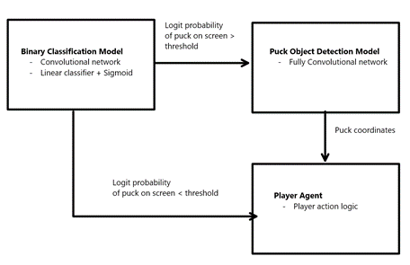
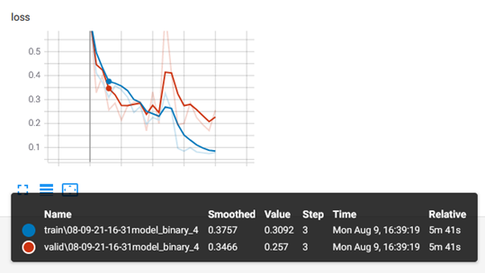
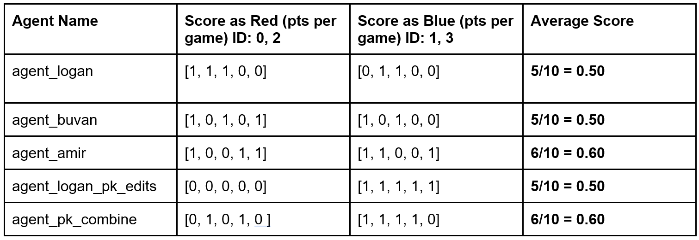

# Computer Vision Video Game AI

*Last updated: August 10, 2021*

This is a summary of Deep Learning computer vision game AI for playing a 2 versus 2 hockey game.
Authors: Logan Kells, Buvaneshwaran T, Amir Ebrahimi, Pranav Kayastha

## Demo
The objective is to score goals against AI in a hockey style of video game. Our controller uses exclusively screen space images to perform object and goal detection plus a bespoke controller logic to control the player steering.

## Setup
From the outset of the project, it was necessary for us to organize the project so that we all could work separately on different models and controllers concurrently. Utility functions for training and data classes for hyper-parameters were added to allow us to experiment with new models and hyper-parameters across a consistent skeleton. We also added an optional argument in the Tournament class that allowed us to watch the game live and select the agent to view in the game. This helped us tune our controllers beyond measuring the training and validation loss and accuracy of puck detection and the puck binary logit.

## Data Collection
In order to collect data to train our models, we modified the play method in the Tournament class so that it called a custom helper function save_image_and_puck_frames for all players at each frame. The function took player and frame data as inputs and saved the image and training labels for puck position in x, y and puck on screen in binary 1, 0 for training. Inside the save_image_and_puck_frames function, we utilized the helper function _to_image from homework five and passed in the puck coordinates, transposed camera projection, and transposed camera view by using world state from the pystk library. With this method, we were able to get the puck location for each image and convert it to normalized (x, y) coordinates. We also divided the images into separate datasets; some with pucks and some without pucks. For training the puck (x, y) coordinate detection model only puck images were fed into the model. For training the binary classifier model a mixed dataset of images with and without pucks was used.

## Deep Learning Models
### Object detection with supervised learning
We used several models, including our models from homework, master solutions, and a model implementing the U-Net architecture to predict the location of the puck in the image screen space.  After experimenting with different models, data augmentations and hyper parameters, we were able to get mean absolute loss down to 0.0134 on a training set of 5,000 images with training time of 16 minutes. 

When we used our models to compete against the AI, we realized that the model activated on the wall and ice features. We compared our model’s prediction to the ground truth location from the pystk library during tournament play and found the mean error to be in the range of 0.15 to 0.2. As a next step, we decreased the layer count from 4 to 3 layers, decreased layer channels to [8, 16, 32], and increased our dataset to 28,000 images generated from different games and player-agents. This model performed significantly better during tournament play against the AI, with validation loss of 0.015 (Figure 1).

Unfortunately, we found that the model did poorly on images where the puck was not on screen. To resolve this issue, we decided to run the image through two models - one to predict whether the puck exists in the image as a binary logit, and one to predict the location of the puck coordinate, (x, y).

### Binary classification with supervised learning
We used a binary classifier to predict the probability of the puck being on screen. If the classifier is a high enough probability of the puck being on screen, then the object detection model is specialized to only predict the location of the puck on screen. By using two models together it allowed us to handle the agent controller logic in both situations where a puck is either present or not present with binary logits at 0.65-0.9 (Figure 2).

The Binary Classification Model is a block-based network with each block containing the following sequence: Convolution2D, ReLU, MaxPool2D, and ReLU. These sequences were repeated for 4 layers. The classification contains a Linear operator followed by a Sigmoid to achieve the logit. A single classification is output in the model.forward method representing the probability of the puck being on screen.

With a dataset of 35,000 images, we were able to get the validation loss (BCEWithLogits) down to 0.26 (Figure 3). We reduced the model parameter size by shrinking the layers and shrinking the input image geometry by 10%, which resulted in a 50% reduction in the binary classifier frame time. The training is comparable between Figure 3 and Figure 4 for the model with reduced layer classes and 10% resolution reduction. The generalized performance of this model was evaluated by running it in tournament.play and printing the probability for each image. We found that the probability was >0.90 when the puck was on screen. However, the model struggled with inconsistent probabilities ranging from [0.10 to 0.88] when there was truly no puck on screen. We resolved this issue by taking the mean binary logit over 5-10 images, depending on the specific agent’s tuning, which stabilized the binary logit for long enough frame time for the agent to steer to the puck (x, y).

### Reinforcement Learning
We also experimented with reinforcement learning on this project by building an imitation learning model that would try to imitate the AI agent. We built on top of the lecture notes and extended the classifier to predict all six actions from the image. Unfortunately, we were not able to get good results and decided to focus on supervised learning models with explicit commands for player.act with custom controller logic.

## Controller
Before embedding our model into our agent, we started to create our agents based on the ground truth position of the puck using the world state from the pystk library. We started with a base agent that was able to score a goal when playing without an opponent. The base agent would accelerate linearly up to the maximum velocity, steer towards the puck, and steer in the direction of the nearest goal post. After achieving this milestone, each of us continued to build out our own separate agents.

To improve controller performance, we also adjusted the maximum velocity depending on the position of the player in the map. We tuned the steering parameters depending on the velocity and screen location of the puck and the goal. We were able to beat the AI after adjusting the controller logic with the puck binary logit, and puck (x, y) coordinate data, velocity logic, and map positioning logic. Next, we implemented an agent that would sprint to the puck to be first in order to bounce the puck away from the AI. The less aggressive agent would then direct a goal by targeting the puck after the first exchange between the aggressive agent and the AI. 

After custom controller tuning, we were able to run each agent against an AI team in 10-game tournaments to decide the best agent for the final project. Based on the average score over the ten games we chose our final submission to be a combination of agent_amir with agent_logan_pk_edits (Table 1). The combination selected agent_amir for the red team and agent_logan_pk_edits for the blue team to capitalize on each model working better for the respective team with our testing. This combination resulted in similar performance to the agent_amir however we hypothesize its performance would generalize better over many tournaments and with the online grader. This combined agent is our final submission for the tournament with the best scoring performance and high frame time efficiency.

## Appendix

**Figure 1**. Training loss (red) and validation loss (blue) for our Object detection model for detecting the puck in normalized screen space (x, y) coordinate.

**Figure 2**. Binary Classification Model determines probability of puck on screen. The images are filtered through the Binary Classification Model, and if a threshold is reached then the image is sent to the Puck Object Detection Model.

**Figure 3**. Training loss (blue) and validation loss (red) for our Binary Classifier #3 model for detecting if the puck is on screen.

**Figure 4**. Training loss (blue) and validation loss (orange) for our Binary Classifier #4 model for detecting if the puck is on screen with reduced layer classes and 10% image resolution reduction.

**Table 1**. 10-Game tournament between player agents with average score of our team versus AI recorded.
